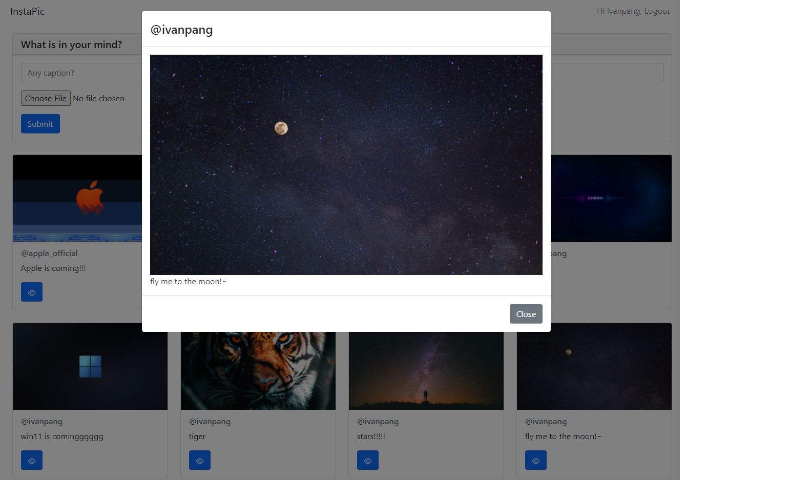

## Introduction
This is a simple image sharing application. It allow users to upload & share their own feeding to others. Users can sign up their own account and able to see others shared image after login.

## UI

## Tech
This app is developed by using React + Spring Boot and the code is ready for AWS environment.  In frontend, Bootstrap is used to speed up the development. I have use gradle to build the frontend & backend into one app. After I have packed this app into a container by using the Dockerfile I have provided.  
For local testing , I have use the `docker-compose`.  
For AWS, I have connected the app in EC2 which is in public subnet. The app can connect to RDS for database and S3 for object storage with proper IAM control & security group.

#### [Frontend](https://github.com/ivanpang1996/image-sharing/tree/main/frontend)

#### [Backend](https://github.com/ivanpang1996/image-sharing/tree/main/backend)

